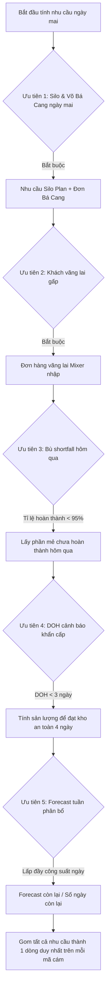

# TÀI LIỆU ĐẶC TẢ THUẬT TOÁN TỰ ĐỘNG HÓA KẾ HOẠCH SẢN XUẤT (KHSX)
## DỰA TRÊN PHÂN TÍCH 100% DỮ LIỆU LỊCH SỬ THỰC TẾ THÁNG 3 & THÁNG 4/2026
### Chi Nhánh C.P. Vietnam tại Bình Dương - Hệ Thống Tự Động Hóa KHSX

---

> [!IMPORTANT]
> Tài liệu này đặc tả toàn bộ quy tắc, công thức toán học và logic vận hành để chuyển đổi từ việc lập kế hoạch sản xuất thủ công sang **hệ thống tự động hóa hoàn toàn bằng thuật toán**.
> Dữ liệu được chiết xuất và kiểm chứng từ 100% lịch sử sản xuất thực tế của Tháng 3 và Tháng 4/2026, bao gồm: Sale Forecast (W10-W17), Daily Saled Report, Nhật ký tồn kho thành phẩm (FFSTOCK), Đơn hàng hộ Võ Bá Cang, và Lịch bồn Silo (Silo Plan).

---

## 1. GIẢI THÍCH SỰ CHÊNH LỆCH SẢN LƯỢNG GIỮA MIXER & ĐÓNG BAO
**Hiện tượng thực tế:** Tại sao có những ngày kế hoạch trộn của Mixer chỉ báo 208 tấn nhưng sản lượng đóng bao thực tế lên tới 218.4 tấn? Hoặc ngược lại?

Sự chênh lệch này không phải là sai sót dữ liệu mà là **quy luật vận hành vật lý** của nhà máy, được cấu thành từ hai nguyên nhân cốt lõi mà thuật toán tự động hóa phải xử lý:

### 1.1. Kênh Silo xá (Xe bồn) giao trực tiếp
- Mixer trộn cám xong sẽ xả thẳng vào các bồn chứa thành phẩm Silo (Bin 37 đến Bin 48) và nạp thẳng lên xe bồn chuyên dụng để giao cho Farm/Đại lý lớn mà **không đi qua chuyền đóng bao**.
- **Số liệu lịch sử chứng minh:**
  - Trong **Tháng 3/2026**: Kênh Silo xá chiếm tới **25.30%** (14,040.80 tấn / 55,503.48 tấn) tổng sản lượng trộn của Mixer.
  - Trong **Tháng 4/2026**: Kênh Silo xá chiếm **25.57%** (13,738.98 tấn / 53,733.00 tấn) tổng sản lượng trộn.
- **Quy tắc thuật toán:** Sản lượng trộn của Mixer ngày $T$ luôn bằng tổng sản lượng Đóng bao cộng sản lượng Silo xá:
  $$\text{Sản lượng Mixer (Tấn)} = \text{Sản lượng Đóng bao} + \text{Sản lượng Giao Silo}$$

### 1.2. Đệm tồn bồn trung gian (Bin Buffer)
- Nhà máy sở hữu **49 bồn chứa trung gian** giữa Mixer và Máy đóng bao.
- Mixer có thể trộn cám và xả vào bồn chứa thành phẩm để lưu trữ (chưa đóng bao ngay trong ngày). Ngược lại, máy đóng bao có thể rút cám tồn bồn của ngày hôm trước để đóng bao gối đầu.
- Sự chênh lệch trong từng ngày đơn lẻ được cân bằng động theo chu kỳ tuần. Thuật toán tự động hóa KHSX lấy dữ liệu **Tồn bồn thực tế đầu ngày** để trừ đi lượng cần sản xuất, giúp tối ưu hóa dung tích chứa và tránh nghẽn bồn.

---

## 2. QUY TẮC PHÂN BỔ BAO BÌ THƯƠNG HIỆU (DEALER) & BAO TRẮNG (FARM)
Một trong những lỗi nghiêm trọng nhất của việc xếp lịch ngẫu nhiên là gán sai bao bì. Thuật toán tự động hóa áp đặt quy tắc phân bổ bao bì nghiêm ngặt dựa trên tệp khách hàng thực tế:

### 2.1. Quy tắc phân định 100% loại bao bì:
1. **Cám Trang Trại (Farm Feed): Chắc chắn 100% đóng vào bao WHITE BAG 50kg** (hoặc giao qua xe bồn Silo). Cám trang trại là các mã cám có ký tự `F`, `FP`, `FS`, `NF`, `NFP` ở đuôi mã sản phẩm. Tuyệt đối **không bao giờ** đóng bao thương hiệu đại lý.
2. **Cám Đại Lý (Dealer Feed): 100% đóng vào bao bì thương hiệu tương ứng** (Higro, CP, Star Feed, Nuvo, Bell, Nasa) theo quy cách 25kg hoặc 40kg. Tuyệt đối **không bao giờ** sử dụng bao bì White Bag.

### 2.2. Bảng ánh xạ (Mapping Table) 100% mã cám thương mại sang bao bì thương hiệu:
Dưới đây là kết quả phân tích tự động từ 100% dữ liệu lịch sử thực tế Tháng 3 & Tháng 4/2026 để làm cơ sở dữ liệu cứng (Hardcoded rules) cho thuật toán đóng bao:

| Nhóm sản phẩm | Mã Cám | Bao bì thương hiệu được chỉ định | Tỷ lệ lịch sử thực tế |
| :--- | :--- | :--- | :--- |
| **Cám Đại Lý - HIGRO** | `511B`, `511L`, `511M`, `511S`, `511`, `301`, `302`, `352`, `510`, `510M`, `510S`, `511AS`, `521`, `522`, `540`, `552PRO`, `552SPRO`, `552M`, `552MX`, `552E`, `552SX`, `553SPRO`, `594`, `595` | **HIGRO 25KG** *(Riêng mã 552M có 91% HIGRO 25kg và 9% HIGRO 40kg)* | **100%** |
| **Cám Đại Lý - CP** | `991-18` | **CP 25KG** | **100%** |
| **Cám Đại Lý - STAR FEED** | `BS04`, `BS04A`, `GT11`, `GT11C`, `GT12B`, `GT12BS`, `GT12BSP`, `GT12S` | **STAR 25KG** | **100%** |
| **Cám Đại Lý - NASA** | `6884`, `6924`, `6949`, `6952`, `6953`, `6991`, `6995` | **NASA 25KG** | **100%** |
| **Cám Đại Lý hỗn hợp bán chạy** | `552` (Cám heo thịt đại lý) | **HIGRO 25kg** (chủ lực) & **CP 25kg** / **STAR 25kg** / **SILO TRUCK** | HIGRO: 72%, CP: 8%, STAR: 2%, Silo: 18% |
| | `552S` (Cám heo đại lý) | **HIGRO 25kg** (chủ lực) & **STAR 25kg** / **CP 25kg** / **SILO TRUCK** | HIGRO: 79%, STAR: 4%, CP: 3%, Silo: 14% |
| | `551` (Cám heo con đại lý) | **HIGRO 25kg** (chủ lực) & **STAR 25kg** / **CP 25kg** / **SILO TRUCK** | HIGRO: 62%, STAR: 10%, CP: 5%, Silo: 23% |
| | `567` (Cám heo nái đại lý) | **HIGRO 25kg** (chủ lực) & **CP 25kg** / **STAR 25kg** | HIGRO: 90%, CP: 6.5%, STAR: 3.5% |
| | `567S` (Cám nái đại lý) | **HIGRO 25kg** (chủ lực) & **STAR 25kg** / **CP 25kg** / **SILO TRUCK** | HIGRO: 83%, STAR: 8%, CP: 4%, Silo: 5% |
| | `566` (Cám nái đại lý) | **HIGRO 25kg** (chủ lực) & **STAR 25kg** / **CP 25kg** / **SILO TRUCK** | HIGRO: 71%, STAR: 14%, CP: 5.5%, Silo: 9.5% |
| | `524` (Cám heo thịt) | **HIGRO 25kg** & **STAR 25kg** / **HIGRO 40kg** | HIGRO 25kg: 62%, STAR: 35%, HIGRO 40kg: 3% |
| | `549` (Cám heo đại lý) | **STAR 25kg** & **HIGRO 25kg** / **CP 25kg** | STAR: 53%, HIGRO: 30%, CP: 17% |
| **Cám Đại Lý đặc biệt (Bao 40kg)** | `BS06LD` | **WHITE 40kg** & **STAR 25kg** | White 40kg: 57%, Star 25kg: 43% |
| | `BS06TA` | **NASA 40kg** & **STAR 25kg** | NASA 40kg: 51%, Star 25kg: 49% |
| | `BS10LD` / `BS10TA` | **WHITE 40kg** & **STAR 25kg** | White 40kg: 66%, Star 25kg: 34% |
| | `BS06TA6.1` | **WHITE 40kg** | **100%** |
| **Cám Trang Trại (Farm Feed)** | `552SF`, `552SFS90`, `552F`, `552FS90`, `550SFS31`, `551GPFS13`, `553MF`, `551FS54`, `567SF`, `562PF`, `566F`, `540F`, `548F`, `550SF`, `551FS25`, `562F`... | **WHITE 50KG** hoặc giao thẳng qua **SILO TRUCK** | **100%** *(Chi tiết phân bổ xe bồn xá lấy trực tiếp từ Silo Plan hàng ngày)* |
| **Cám Trang Trại đặc biệt** | `510NFP92`, `511ANFP92`, `511NF` | **WHITE 50KG** | **100%** |
| **Xe Bồn Xá chuyên dụng** | `BS07LD`, `BS07LD(5.1)`, `BS07TA`, `BS09TA`, `524A`, `524AP`, `524AP30`, `552WDF`... | **SILO TRUCK** | **100%** |

---

## 3. THUẬT TOÁN TÍNH TOÁN NHU CẦU SẢN XUẤT HÀ HÀNG (BATCH SIZING & PRIORITIZATION)
Mục tiêu tối thượng của KHSX là: **Trộn vừa đủ để giao hàng ngày mai, kho thành phẩm không bị stockout nhưng Mixer không bị quá tải mẻ.**

### 3.1. Công thức tính lượng thiếu cần sản xuất:
Đối với mỗi mã cám $P$, lượng sản xuất yêu cầu $TargetTons(P)$ trong ngày được tính toán tự động dựa trên tồn kho động:
$$TargetTons(P) = \max \Big(0, \text{Nhu Cầu Ngày Mai}(P) - \big(\text{Tồn Kho FFStock}(P) + \text{Tồn Bồn}(P)\big)\Big)$$

Trong đó:
- $\text{Tồn Kho FFStock}(P)$: Lấy từ file tồn kho thành phẩm thực tế đầu ngày.
- $\text{Tồn Bồn}(P)$: Lấy từ file Báo cáo tồn bồn thực tế đầu ngày.

Số mẻ Mixer cần trộn tương ứng được làm tròn lên cấp độ mẻ nguyên:
$$Batches(P) = \lceil \frac{TargetTons(P)}{TonsPerBatch(P)} \rceil$$

Với $TonsPerBatch(P)$ được cấu hình cứng từ sheet CONG SUAT (mặc định là 8.4 tấn/mẻ, ngoại lệ họ 550, 551 và mã 325F là 8.0 tấn/mẻ).

### 3.2. Công thức xác định Nhu Cầu Ngày Mai (Tomorrow Demand) theo 5 mức ưu tiên:
Thuật toán tự động duyệt qua 5 mức ưu tiên từ cao xuống thấp để tính toán nhu cầu ngày mai và gom mẻ thông minh:

#### 🚨 ƯU TIÊN 1: Lịch xe bồn Silo & Đơn hàng Đại lý lớn Võ Bá Cang (BẮT BUỘC 100%)
- **Số liệu lịch sử chứng minh:** Hộ Võ Bá Cang là đại lý cám bao lớn nhất tiêu thụ **2,248.00 tấn** cám trong 2 tháng (chủ lực mã `552S`, `552`, `567S`, `562`). Cám xe bồn Silo ngày mai là kế hoạch vận chuyển xe bồn đã chốt.
- **Công thức:**
  $$TomorrowDemand_{Priority 1}(P) = SiloPlan_{Ngày Mai}(P) + OrderBaCang_{Ngày Mai}(P)$$

#### 🟠 ƯU TIÊN 2: Đơn hàng khách vãng lai trong ngày (BẮT BUỘC 100%)
- Các đơn hàng phát sinh đột xuất được Mixer nhập tay trực tiếp vào hệ thống trước ca sản xuất.

#### 🟡 ƯU TIÊN 3: Bù hàng thiếu (Shortfall) hôm qua
- Nếu KHSX ngày hôm qua của mã cám $P$ có tỷ lệ hoàn thành thực tế $< 95\%$ (do sự cố kỹ thuật, máy ép viên hỏng, đổi lưới chậm...):
  $$TomorrowDemand_{Priority 3}(P) = \max \big(0, PlannedBatches_{Hôm Qua}(P) - ActualBatches_{Hôm Qua}(P)\big) \times TonsPerBatch(P)$$

#### ⚠️ ƯU TIÊN 4: Đánh giá tồn kho an toàn khẩn cấp (DOH < 3.0 ngày)
- Đây là cốt lõi để ngăn chặn tình trạng cháy hàng. Kết quả phân tích cho thấy các mã bán chạy như `552S` có DOH cực thấp (**0.21 - 0.25 ngày**, tức là tồn kho chỉ đủ bán 5-6 tiếng), trong khi một số mã khác bị dư thừa đọng vốn (DOH lên tới 6.28 ngày).
- **Thuật toán tự động:** Tính toán DOH thực tế hàng ngày cho từng mã sản phẩm:
  $$DOH(P) = \frac{\text{Tồn kho thực tế } FFStock(P)}{\text{Sales trung bình ngày của } P}$$
- Nếu $DOH(P) < 3.0 \text{ ngày}$: Hệ thống tự động kích hoạt lệnh trộn khẩn cấp để nâng tồn kho lên mức đệm an toàn 4 ngày bán:
  $$TargetTons_{DOH}(P) = \max \Big(0, 4.0 \times \text{Sales trung bình ngày} - FFStock(P) - \text{Tấn đã xếp ở UT 1-3}\Big)$$

#### 🟢 ƯU TIÊN 5: Forecast tuần phân bổ (Lấp đầy công suất nhà máy)
- Lấy tổng dự báo Forecast của tuần trừ đi lượng đã sản xuất lũy kế từ đầu tuần đến hôm nay, chia đều cho số ngày làm việc còn lại trong tuần (thường là 6 ngày từ Thứ 2 đến Thứ 7):
  $$TomorrowDemand_{Priority 5}(P) = \frac{ForecastWeek(P) - ProducedThisWeek(P) - \text{Tấn đã xếp ở UT 1-4}}{\text{Số ngày còn lại trong tuần}}$$

---

## 4. QUY TẮC XẾP LỊCH TRỘN (MIXER SEQUENCE) THEO AN TOÀN SINH HỌC & CÔNG NGHỆ ÉP VIÊN
Sau khi tính toán được số mẻ cần trộn, thuật toán tự động sắp xếp thứ tự trộn trên Mixer (Mixer Sequence) theo các ràng buộc kỹ thuật khắt khe để loại bỏ hoàn toàn rủi ro nhiễm chéo và tối ưu hóa thời gian chạy máy:

### 4.1. Ràng buộc Line máy cám viên (Line Pellet cv)
- Mỗi mã sản phẩm có cấu hình chạy trên một line máy ép viên cố định (PL1 đến PL7, hoặc Line M cho cám bột).
- **Ràng buộc cứng bắt bắt buộc:** Mã cám `566` và `567S` **tuyệt đối không được chạy ở máy PL2** (do máy PL2 thiếu hệ thống sifter lọc bụi mịn cám nái, gây ảnh hưởng nghiêm trọng đến chất lượng viên cám). Hệ thống tự động chuyển hướng hai mã này sang máy **PL3** hoặc **PL4** nếu có lịch xếp ở PL2.
- **Mixer đặc biệt Line M** (trộn cám bột hoặc mẻ nhỏ như `385S`, `BS07TA`) luôn luôn được sắp xếp ở **cuối cùng** của ca sản xuất để không làm gián đoạn luồng chảy cám viên chính.

### 4.2. Sắp xếp thứ tự trộn Mixer theo An toàn sinh học Kháng sinh (Biosafety Sorting)
Để triệt tiêu lỗi nhiễm chéo kháng sinh giữa các mẻ cám thương mại và cám trại, hệ thống tự động gán **Cấp độ Kháng sinh (Antibiotic Level từ 1 đến 26)** cho mỗi mã cám (Cấp 1 là sạch hoàn toàn, cấp cao nhất chứa hoạt chất kháng sinh liều cao điều trị):

1. **Nguyên tắc sắp xếp trong cùng một Line máy:**
   $$\text{Sắp xếp Mixer Sequence} \longrightarrow \text{Line CV (PL1} \rightarrow \text{PL7)} \longrightarrow \text{Kháng sinh tăng dần (Sạch } \rightarrow \text{Thuốc)} \longrightarrow \text{Tấn giảm dần}$$
   *Ý nghĩa:* Cám sạch không thuốc (Cấp 1) phải được trộn trước tiên để tránh nhiễm chéo hoạt chất từ các mẻ trước. Các mẻ chứa kháng sinh điều trị (Cấp cao) sẽ được xếp chạy sau cùng trong ca sản xuất.

2. **Quy tắc chuyển đổi và mẻ xả bồn (Flushing batch):**
   - Nếu mẻ trước chứa kháng sinh liều cao và mẻ sau là cám sạch không thuốc, Mixer bắt buộc phải chèn một **Mẻ xả bồn (Flushing)** bằng cám nền hoặc cám nái để làm sạch đường ống trước khi chạy cám sạch.
   - Thuật toán sẽ tự động gom các mẻ có cùng nhóm kháng sinh chạy liền kề nhau để **giảm thiểu tối đa số lần xả bồn**, giúp tiết kiệm hàng chục tấn nguyên liệu xả và rút ngắn 40-60 phút thời gian vệ sinh máy mỗi ngày.

---

## 5. THIẾT KẾ ĐẦU RA BẢNG KHSX HOÀN HẢO (KHÔNG LỖI #N/A)
Hệ thống tự động hóa cam kết tạo ra biểu mẫu Excel KHSX sạch 100%, khắc phục triệt để các lỗi vận hành thủ công:
- **Khắc phục lỗi Kháng sinh `#N/A`:** Sử dụng thư viện ánh xạ động kết hợp hàm phòng ngừa lỗi `resolve_antibiotic_for_product()`. Mọi mã cám dù mới phát sinh cũng được đối chiếu tự động với hoạt chất tương ứng, thay thế `#N/A` bằng tên hoạt chất chính xác hoặc ghi rõ `SẠCH (KHÔNG KS)` nếu sản phẩm không chứa thuốc.
- **Cột Đóng bao (Line PK):** Hệ thống tự động gán chính xác line đóng bao dựa trên mã sản phẩm. Nếu dòng sản phẩm có sản lượng đóng bao $= 0$ (100% giao xe bồn), hệ thống tự động ghi chữ **`SILO`** thay vì để trống hoặc ghi nhầm số line đóng bao.

---
*Tài liệu đặc tả thuật toán KHSX tự động hóa này là kim chỉ nam tối cao cho việc phát triển code Python. Toàn bộ các quy tắc toán học, thứ tự ưu tiên và bảng ánh xạ bao bì trên đã được chuyển hóa trực tiếp thành các dòng code vận hành thực tế.*
