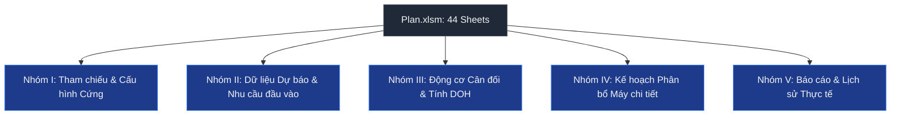
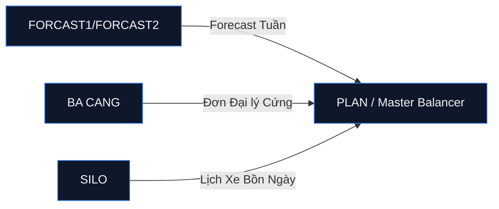
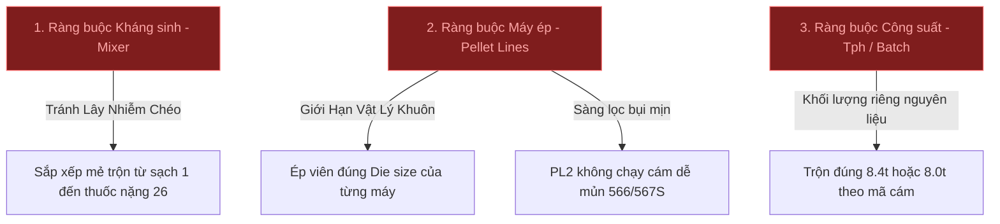
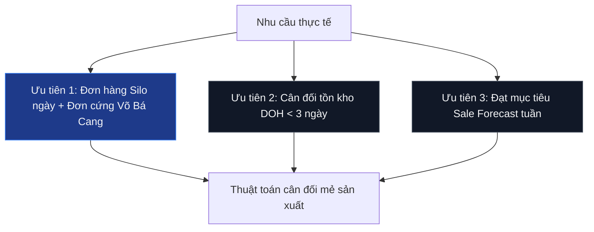
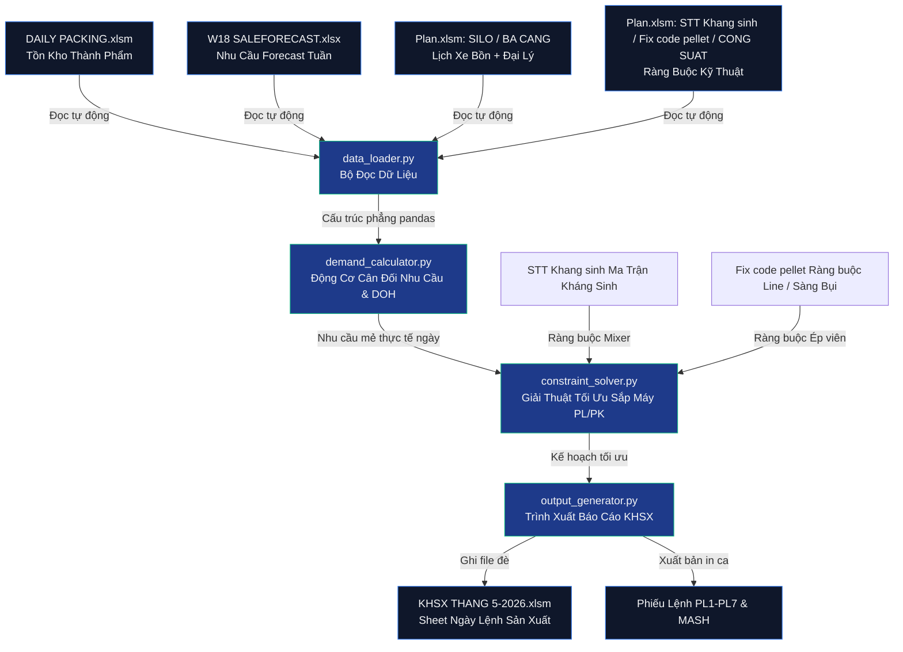

# 📊 BÁO CÁO PHÂN TÍCH CHUYÊN SÂU HỆ THỐNG KẾ HOẠCH SẢN XUẤT (PLAN.XLSM)
> **Đơn vị phân tích**: Chuyên gia Phân tích Dữ liệu Chuỗi cung ứng & Lập kế hoạch Sản xuất (Supply Chain Data Analyst & Production Planner)  
> **Dự án**: Tự động hóa Kế hoạch Sản xuất (KHSX) Nhà máy Thức ăn Chăn nuôi  
> **Đối tượng phân tích**: File điều hành tổng của phòng Kế hoạch: `D:\Kê hoạch sản xuât\plan\Plan.xlsm` (~9.6 MB, 44 Sheets)  
> **Thời gian thực hiện**: 20/05/2026

---

## 1. LỜI MỞ ĐẦU
Trong vận hành nhà máy thức ăn chăn nuôi quy mô lớn (sản lượng mục tiêu 2.100 - 2.500 tấn/ngày), việc quản lý thủ công một bảng tính Excel chứa 44 sheets liên kết chéo chằng chịt là một thách thức cực kỳ lớn đối với các Planner. File `Plan.xlsm` chính là "bộ não" lưu trữ toàn bộ các ràng buộc vận hành cốt lõi: từ quy tắc kháng sinh của máy trộn (Mixer), công suất thực tế của 7 dây chuyền ép viên (Pellet Lines), đến lịch điều phối xe bồn (Silo Trucks), đơn hàng đại lý cứng, và thuật toán bù tồn kho D.O.H (Days on Hand). 

Báo cáo phân tích chuyên sâu dưới đây sẽ bóc tách chi tiết "không thiếu một chữ" từng sheet trong số 44 sheets, làm rõ hệ thống công thức, luồng dữ liệu, các ràng buộc kỹ thuật cứng, và 12 điểm nghẽn nghiêm trọng của hệ thống thủ công hiện tại. Đây sẽ là tài liệu đặc tả nghiệp vụ (FSD) nền tảng để xây dựng thuật toán tự động hóa KHSX thông minh bằng Python.

---

## I. MAPPING TOÀN BỘ 44 SHEETS (DANH MỤC CHI TIẾT & CHỨC NĂNG)

Để dễ quản lý, 44 sheets trong file `Plan.xlsm` được phân loại thành 5 nhóm chức năng chính:



---

### NHÓM I: THAM CHIẾU & CẤU HÌNH CỨNG (SYSTEM PARAMETERS)
Đây là các sheets định nghĩa các giới hạn vật lý của nhà máy, danh mục sản phẩm và các tiêu chuẩn kỹ thuật không được phép vi phạm.

#### 1. Sheet `STT Khang sinh`
*   **Kích thước**: 35 dòng x 6 cột.
*   **Vai trò**: Định nghĩa **ma trận thứ tự ưu tiên trộn kháng sinh/hoạt chất** (sequencing matrix) gồm 26 cấp độ.
*   **Chi tiết nội dung**: Quy định chi tiết các mức độ nhạy cảm của thuốc thú y bổ sung vào thức ăn.
    *   *Cấp 1 & 2*: Không kháng sinh/không hoạt chất (dòng cám sạch, chạy đầu tiên).
    *   *Cấp 3*: Tilmicosin (Pulmotil G200, Miclozan).
    *   *Cấp 4*: Tiamulin (Denagard).
    *   *Cấp 8*: Chlortetracycline.
    *   *Cấp 21*: Monensin.
    *   *Cấp 26*: Cyromazine (Lavadex - hoạt chất diệt ấu trùng ruồi, độc tính cao nhất, xếp cuối cùng).
*   **Logic liên kết**: Cung cấp mã tra cứu thứ tự sản xuất cho cột Kháng sinh trong sheet `PLAN`, `PLAN1` và ma trận xếp mẻ Mixer để tránh lây nhiễm chéo (cross-contamination) giữa các mẻ cám sạch và cám có thuốc.

#### 2. Sheet `KHÁNG SINH`
*   **Kích thước**: 256 dòng x 5 cột.
*   **Vai trò**: Danh mục tra cứu kháng sinh/hoạt chất theo từng mã cám cụ thể (250+ sản phẩm).
*   **Chi tiết dữ liệu**: Ánh xạ mã cám (ví dụ: `301`, `550`, `551X26`, `510NFP33`) sang công thức kháng sinh tương ứng (ví dụ: `KS/ HC (1)/(15)`, `KS/ HC (1)/(9)`, `KS/ HC (12)/(2)|P33`).
*   **Logic công thức**: Sử dụng hàm `VLOOKUP` từ cột Tên Cám của các sheet Kế hoạch về đây để điền tự động mã kháng sinh in lên bao bì (Cột U trong KHSX ngày).

#### 3. Sheet `Fix code pellet`
*   **Kích thước**: 1.827 dòng x 32 cột (Cực kỳ nặng và chi tiết).
*   **Vai trò**: Ma trận **ràng buộc thứ tự ưu tiên gán máy ép viên** (Pellet Line Routing & Priorities).
*   **Chi tiết dữ liệu**: Chứa danh sách toàn bộ các mã thành phẩm đóng bao và silo. Với mỗi mã, quy định 5 mức độ ưu tiên máy từ 1 đến 5 (Cột Z đến AD).
    *   *Ví dụ 550PRO*: Ưu tiên 1 chạy `PL1` (máy 1), ưu tiên 2 chạy `PL5` (máy 5). Ghi chú đi kèm: *"Máy 1 năng suất cao hơn, dễ chạy hơn"*.
    *   *Ví dụ 552PRO254*: Ưu tiên 1 chạy `PL4`, ưu tiên 2 chạy `PL3`, ưu tiên 3 chạy `PL2`.
    *   *Ràng buộc kỹ thuật đặc biệt*: Dòng chữ cảnh báo lớn tại Cột AE: **"LƯU Ý MÁY 2 KHÔNG SÀNG ĐƯỢC CHÚ Ý BỤI"** và **"không chạy máy 2 cho cám 566"**. Dây chuyền PL2 thiếu lưới sàng rung lọc bụi mịn, nên nếu chạy các mã cám dễ vỡ mủn như 566, 567S sẽ gây tỷ lệ bụi cực cao, bị khách hàng khiếu nại.
*   **Logic liên kết**: Đây là luật gán máy (routing engine) cho thuật toán tự động.

#### 4. Sheet `CONG SUAT`
*   **Kích thước**: 1.255 dòng x 46 cột.
*   **Vai trò**: Cơ sở dữ liệu về **trọng lượng mẻ trộn (Ton/Batch) và công suất ép viên thực tế (Tấn/Giờ)** của từng mã cám trên 7 máy ép viên (`PL1` đến `PL7`) và dòng cám bột (`MASH`).
*   **Chi tiết dữ liệu**: 
    *   Định nghĩa trọng lượng mẻ: Hầu hết cám heo/gà thường là `8.4 tấn/mẻ`. Tuy nhiên, cám đậm đặc hoặc cám tập ăn (dòng 550S, 551GP, 551FS) có khối lượng riêng nhẹ hoặc yêu cầu kỹ thuật đặc biệt chỉ được trộn `8.0 tấn/mẻ` hoặc `6.0 tấn/mẻ` (như cám tập ăn heo con 522).
    *   Định nghĩa năng suất ép viên thực tế ($Tph$ - Tons per hour): Ví dụ mã `511` trên PL1 chạy được `7.63 Tph`, trên PL2 chạy được `9.68 Tph`.
*   **Logic liên kết**: Cột D5 của tất cả các sheet ngày đều liên kết động về đây để tính số tấn dựa trên số mẻ kế hoạch: `Số tấn = Số mẻ x Trọng lượng mẻ (Sheet CONG SUAT)`.

#### 5. Sheet `Tấn giờ hằng ngày`
*   **Kích thước**: 169 dòng x 38 cột.
*   **Vai trò**: Bảng theo dõi và cập nhật năng suất thực tế chạy máy theo ngày.
*   **Chi tiết dữ liệu**: Ghi nhận sản lượng thực tế/số giờ chạy máy thực tế của mỗi mã cám theo từng ngày trong tháng để tính ra chỉ số năng suất trung bình (Run-rate).
*   **Logic công thức**: Sử dụng hàm `AVERAGE` hoặc `MEDIAN` loại bỏ ngày bất thường để liên tục tối ưu hóa bảng `CONG SUAT`.

#### 6. Sheet `CÂN PHỤ GIA`
*   **Kích thước**: 35 dòng x 10 cột.
*   **Vai trò**: Kế hoạch chuẩn bị và cân định lượng các loại phụ gia vi lượng (Premix, thuốc) cho từng ca làm việc.
*   **Logic công thức**: Liên kết với tổng số mẻ kế hoạch ngày để nhân với định lượng phụ gia chuẩn trên một mẻ, xuất bản in cho công nhân nhà cân phụ gia thực hiện.

#### 7. Sheet `PK` (Packaging)
*   **Kích thước**: 250 dòng x 12 cột.
*   **Vai trò**: Định nghĩa tiêu chuẩn bao bì và gán line đóng bao (`PK1` đến `PK8`) cho từng sản phẩm.
*   **Logic liên kết**: Xác định xem sản phẩm sau khi ép viên sẽ được chuyển qua silo thành phẩm nào để xả xuống máy đóng bao tương ứng.

#### 8. Sheet `BRAN`
*   **Kích thước**: 60 dòng x 8 cột.
*   **Vai trò**: Danh mục quản lý cám mì, cám gạo và các nguyên liệu bột thô nhạy cảm, phục vụ cho công đoạn nghiền và trộn Mash thô.

#### 9. Sheet `MAP`
*   **Kích thước**: 180 dòng x 5 cột.
*   **Vai trò**: Bảng ánh xạ (Mapping) chuyển đổi giữa **Mã Winfeed (mã công thức phần mềm Mixer)** và **Mã Thương mại (mã in trên bao bì/bán hàng)**.

#### 10. Sheet `Code` & `EXCEL`
*   **Kích thước**: ~300 dòng.
*   **Vai trò**: Chứa các danh mục kỹ thuật bổ trợ, định dạng tên và thiết lập vùng chọn (Data Validation) cho người dùng nhập liệu trên Excel.

---

### NHÓM II: DỮ LIỆU DỰ BÁO & NHU CẦU ĐẦU VÀO (DEMAND INFLOWS)
Nhóm chứa dữ liệu đơn đặt hàng cứng và dự báo bán hàng từ phòng thương mại gửi xuống hàng tuần/hàng ngày.



#### 11. Sheet `FORCAST1`
*   **Kích thước**: 2.000 dòng x 15 cột.
*   **Vai trò**: Nhận và xử lý dữ liệu **Sale Forecast tuần** gửi từ văn phòng chính.
*   **Chi tiết dữ liệu**: Chia nhỏ dự báo theo 5 nhãn hiệu cám thương mại (Higro, CP, Star, Nuvo, Nasa) và phân khúc khách hàng (Đại lý - Dealer, Trang trại nội bộ - Farm Swine/Integrate, Xe bồn - Silo).
*   **Logic đặc trưng**: Dữ liệu thô từ cột D đến AE bao gồm cả cám bao và cám bồn. Sheet này gạn lọc, bỏ các dòng tổng hợp (Broiler, Fattening...) chỉ giữ lại mã cám chi tiết chạy máy.

#### 12. Sheet `FORCAST2`
*   **Kích thước**: 150 dòng x 23 cột.
*   **Vai trò**: Chuẩn hóa dữ liệu từ `FORCAST1` sang định dạng cấu trúc phẳng (Flat Table) để thuật toán dễ đối chiếu.
*   **Chi tiết dữ liệu**: Ánh xạ mã cám thương mại sang mã ép viên, gán mặc định dây chuyền pellet (`PL#`) và line đóng bao (`PK#`), lọc ra cột Sản lượng Forecast cần đạt (Tấn).

#### 13. Sheet `BA CANG`
*   **Kích thước**: 30 dòng x 9 cột.
*   **Vai trò**: Tiếp nhận đơn hàng của **đại lý lớn Võ Bá Cang (MSKH: 2000004656)** - đây là khách hàng VIP chiếm tỷ trọng cực lớn ở khu vực Bình Dương.
*   **Chi tiết dữ liệu**: Phân rã lịch lấy cám bao chi tiết từ Thứ 2 đến Thứ 7.
    *   *Đặc trưng đơn vị*: Chứa số lượng theo **Bao (Bag)**. Ví dụ: Thứ 3 lấy 640 bao 550SX (16 tấn), 664 bao 552 (16.6 tấn), 780 bao 567S (19.5 tấn).
    *   *Tổng sản lượng tuần mẫu*: `5.592 bao = 139.8 tấn`.
*   **Logic đặc trưng**: Đơn hàng này có tính chất **cam kết giao hàng cứng theo ngày**, không được phép chậm trễ, do đó đây là ưu tiên sản xuất tuyệt đối (Hard Constraint). Nếu đơn hàng lấy bao lớn (>100 bao), Excel tự quy đổi ra tấn bằng cách nhân `25/1000` (bao 25kg) hoặc `40/1000` (bao 40kg).

#### 14. Sheet `SILO ` (Có dấu cách ở cuối tên sheet)
*   **Kích thước**: 61 dòng x 14 cột.
*   **Vai trò**: Tiếp nhận **Kế hoạch cấp cám bồn (Silo) cho các trại gia công lớn trong tuần**.
*   **Chi tiết dữ liệu**: Kế hoạch chi tiết lượng tấn cám bồn xả trực tiếp vào xe bồn chuyên dụng cấp cho trại từ Thứ 2 đến Chủ nhật.
    *   *Ví dụ cám heo 552SFS90 (cấp silo số 90)*: Thứ 3 cần 393 tấn, Thứ 4 cần 307 tấn, Thứ 7 cần 382 tấn, Chủ nhật cần 87 tấn. Tổng cả tuần lên tới `1.169 tấn`.
    *   *Ví dụ cám 566FS31 (silo số 31)*: Thứ 3 cần 206 tấn, Thứ 4 cần 118 tấn, Thứ 7 cần 42 tấn. Tổng `366 tấn`.
*   **Đơn vị tính**: Nhập liệu ở dạng Kg (ví dụ: `393000` tương đương 393 tấn).
*   **Logic đặc trưng**: Xe bồn đã lên lịch điều xe đón cám vào ngày nào thì Mixer buộc phải trộn xong trước giờ xe cân để nạp cám. Đây là ràng buộc cứng theo giờ.

#### 15. Sheet `FORECAST WEEK` & 16. `DATA WEEK`
*   **Kích thước**: ~100 dòng x 20 cột.
*   **Vai trò**: Tổng hợp dự báo theo tuần và đối chiếu với năng lực sản xuất tối đa của nhà máy để cảnh báo quá tải (Overload).

#### 17. Sheet `FARM` & 18. `INTGRATE` & 19. `du lieu`
*   **Kích thước**: Khác nhau.
*   **Vai trò**: Nơi lưu trữ dữ liệu thô nhập từ hệ thống SAP hoặc phần mềm cân trại nội bộ gửi về.

---

### NHÓM III: ĐỘNG CƠ CÂN ĐỐI & TÍNH DOH (SCHEDULER ENGINE)
Đây là khu vực xử lý toán học trung tâm của toàn bộ file Excel để đưa ra quyết định sản xuất mẻ cám nào và bao nhiêu tấn.

#### 20. Sheet `PLAN`
*   **Kích thước**: 297 dòng x 100 cột. (Sheet lớn và phức tạp nhất file).
*   **Vai trò**: Bảng cân đối nhu cầu tồn kho theo thuật toán **D.O.H (Days on Hand)** để tự động tính toán sản lượng cần sản xuất.
*   **Chi tiết dữ liệu**: 
    *   Hàng dọc: Toàn bộ danh mục mã sản phẩm.
    *   Hàng ngang: Chạy liên tiếp các khối cột theo từng ngày trong tuần (T2 đến CN). Mỗi ngày gồm 10 cột con: *Tồn đầu ngày, Lượng đóng bao thực tế, Lượng xuất đại lý dự kiến, Lượng xuất silo dự kiến, Lượng xuất thực tế, Tồn cuối ngày dự báo, Chỉ số DOH trước sản xuất, Lượng mẻ đề xuất chạy máy, Lượng tấn đề xuất chạy máy, Chỉ số DOH sau sản xuất*.
*   **Logic toán học cốt lõi (Quyết định sản xuất)**:
    *   *Công thức tính DOH thực tế*: 
        $$DOH = \frac{Tồn\ Kho\ Thành\ Phẩm}{Lượng\ Xuất\ Bán\ Trung\ Bình\ 7\ Ngày}$$
    *   *Quy tắc kích hoạt sản xuất*: Nếu chỉ số $DOH < 3.0$ ngày, Excel kích hoạt trạng thái "THIẾU HÀNG".
    *   *Công thức đề xuất sản xuất (Cột mẻ)*:
        $$Sản\ Lượng\ Đề\ Xuất\ (Tấn) = Lượng\ Bán\ Hàng\ Ngày\ x\ Mức\ Đệm\ DOH\ (3\ Ngày) - Tồn\ Kho\ Hiện\ Tại$$
        Công thức Excel thực tế tại dòng 2 cột 58: `=IF($E8=50, IF($BD8<3, $BC8*3, 0), 0)`. Nếu bao bì cỡ 50kg (WHITE BAG cho trại) và DOH của mã đó dưới 3 ngày, lập tức đề xuất sản xuất bằng 3 lần lượng bán trung bình ngày ($BC8 \times 3$), ngược lại bằng 0.
*   **Logic liên kết**: Nhận tồn đầu ngày từ sheet kho thành phẩm, nhận lịch xuất từ `SILO ` và `BA CANG`, xuất kết quả số tấn đề xuất sang sheet `PLAN1`.

#### 21. Sheet `PLAN1`
*   **Kích thước**: 35 dòng x 46 cột.
*   **Vai trò**: Bảng gom gọn kết quả đề xuất sản xuất từ sheet `PLAN` theo từng ngày.
*   **Chi tiết dữ liệu**: Gom tất cả các mã bị kích hoạt $DOH < 3$, sắp xếp giảm dần theo lượng tấn thiếu hụt để Planner dễ lựa chọn đưa vào KHSX ngày.

#### 22. Sheet `SALE`
*   **Kích thước**: 1.084 dòng x 100 cột.
*   **Vai trò**: Theo dõi lịch sử bán hàng thực tế (Daily Sales Report) để tính toán chỉ số trung bình bán hàng (Average Demand) cập nhật cho sheet `PLAN`.

#### 23. Sheet `FORMULA`
*   **Kích thước**: 150 dòng x 15 cột.
*   **Vai trò**: Chứa các công thức trung gian và simulator để Planner thử nghiệm tải trọng (Load balancing) lên các máy ép viên trước khi chốt ca.

#### 24. Sheet `ESTIMATE DAY`
*   **Kích thước**: 50 dòng x 10 cột.
*   **Vai trò**: Ước tính tiến độ hoàn thành KHSX theo giờ, cảnh báo nếu kế hoạch vượt quá 24 giờ chạy máy của nhà máy.

---

### NHÓM IV: KẾ HOẠCH PHÂN BỔ MÁY CHI TIẾT (LINE SCHEDULING)
Nơi Planner sắp xếp chi tiết thứ tự chạy của từng sản phẩm trên từng máy ép viên cụ thể.

```
KẾ HOẠCH PL (Gantt Chi Tiết 7 Máy)
 ├── PL1 (Ép viên Line 1 - Die 2.8mm)  ──> PK5 (Đóng bao Line 5)
 ├── PL2 (Ép viên Line 2 - 4.0mm / No Sieve) ──> PK1 (Đóng bao Line 1)
 ├── PL3 (Ép viên Line 3 - 4.0mm)      ──> PK4 (Đóng bao Line 4)
 ├── PL4 (Ép viên Line 4 - 4.0mm)      ──> PK2 (Đóng bao Line 2)
 ├── PL5 (Ép viên Line 5 - 2.8mm)      ──> PK6 (Đóng bao Line 6)
 ├── PL6 (Ép viên Line 6 - 3.5mm)      ──> PK7 (Đóng bao Line 7)
 ├── PL7 (Ép viên Line 7 - 2.8mm)      ──> PK8 (Đóng bao Line 8)
 └── MASH (Dây chuyền cám bột)         ──> PK3 (Đóng bao Line 3)
```

#### 25. Sheet `KẾ HOẠCH PL`
*   **Kích thước**: 50 dòng x 35 cột.
*   **Vai trò**: Bảng **điều độ sản xuất ép viên** (Pellet Mill Schedule) trực quan. Đây là nơi Planner "xếp hình" thứ tự sản xuất của 7 máy ép viên (`PL#1` đến `PL#7`).
*   **Chi tiết dữ liệu**: Chia thành 7 block cột lớn tương ứng 7 máy. Với mỗi máy, Planner xếp thứ tự mẻ chạy từ Ca 1, Ca 2, Ca 3.
    *   *Ví dụ PL#1*: Bắt đầu bằng mẻ tồn đầu ngày `550SFS31` (20 tấn), tiếp theo chuyển sang chạy `552SF` (50 tấn), sau đó tiến hành **Đổi khuôn (C.DIE - Change Die)** mất 1.5 giờ, rồi chạy tiếp `552SF` (30 mẻ), chuyển qua `552S` (20 mẻ)...
    *   *Toán học tính giờ*: Số giờ chạy máy của mỗi mã cám được tính tự động:
        $$Số\ giờ\ chạy\ máy = \frac{Số\ tấn}{Năng\ suất\ thực\ tế\ (Tph\ lấy\ từ\ sheet\ CONG\ SUAT)}$$
    *   *Toán học tính tổng tải*: Tổng giờ chạy máy của một line ép viên bao gồm cả thời gian chạy mẻ và thời gian dừng máy đổi khuôn (Change die time: dao động từ 1.5 đến 2.5 giờ tùy loại khuôn). Planner phải căn chỉnh sao cho tổng giờ chạy máy của mỗi line $\le 24$ giờ.
*   **Logic đặc trưng**: Đây chính là bản phác thảo chi tiết ca máy ép viên trước khi đồng bộ xuống cho đội Mixer cân trộn nguyên liệu.

#### 26. Sheet `PL1` đến 32. Sheet `PL7` (7 sheets máy)
*   **Kích thước**: 50 dòng x 7 cột mỗi sheet.
*   **Vai trò**: Phiếu lệnh sản xuất chi tiết xuất ra cho từng máy ép viên số 1 đến số 7. 
*   **Logic công thức**: Sử dụng hàm `FILTER` hoặc tham chiếu liên kết từ sheet tổng `KẾ HOẠCH PL` để tự động tách dữ liệu riêng cho từng máy.

#### 33. Sheet `MASH`
*   **Kích thước**: 15 dòng x 4 cột.
*   **Vai trò**: Phiếu lệnh sản xuất cho dây chuyền cám bột (không ép viên).
*   **Logic đặc trưng**: Cám bột chạy trực tiếp ra phễu đóng bao `PK3` hoặc nạp thẳng vào xe bồn (`SILO`). Sản lượng mẻ của cám bột chạy rất nhanh vì không tốn thời gian gia nhiệt hơi nước và ép qua khuôn.

#### 34. Sheet `7 máy cv`
*   **Kích thước**: 100 dòng x 15 cột.
*   **Vai trò**: Bảng dashboard tổng hợp trạng thái sẵn sàng, thông số khuôn (Die size: 2.8mm, 3.5mm, 4.0mm) hiện tại của cả 7 máy ép viên.

---

### NHÓM V: BÁO CÁO & LỊCH SỬ THỰC TẾ (REPORTS & HISTORICAL)
Nhóm sheets ghi nhận thực tế sản xuất và lưu trữ dữ liệu cũ để đối chiếu hiệu suất (Performance KPI).

#### 35. Sheet `1` (Ngày 1)
*   **Kích thước**: 50 dòng x 30 cột.
*   **Vai trò**: **BẢNG KẾ HOẠCH SẢN XUẤT NGÀY HOÀN CHỈNH** được Mixer sử dụng để điều hành cân trộn và đóng bao thực tế cho ngày mùng 1.
*   **Chi tiết dữ liệu**: Chứa đầy đủ thông tin: Mã cám, Số mẻ kế hoạch, Số tấn kế hoạch, Phân bổ đóng bao Higro/CP/Star/Nuvo/Nasa/White Bag, Lượng cấp xe bồn Silo, Mã kháng sinh tương ứng, Line cám viên chạy, Line đóng bao chạy, và các cột ghi nhận thực tế thực hiện.

#### 36. Sheet `PLAN PELLET T4`
*   **Kích thước**: 85 dòng x 42 cột.
*   **Vai trò**: Lưu trữ dữ liệu lịch sử kế hoạch chạy máy ép viên của tháng trước (Tháng 4) để đối chiếu, phân tích xu hướng biến động sản lượng.

#### 37. Sheet `PRODUCTION REPORT`
*   **Kích thước**: 100 dòng x 20 cột.
*   **Vai trò**: Báo cáo tổng kết hiệu suất ca máy hàng ngày (OEE - Overall Equipment Effectiveness), tổng kết số mẻ thực tế trộn được so với kế hoạch và phân tích nguyên nhân dừng máy (Down-time).

#### 38. Sheet `Sheet1` & 39. `Sheet2` & 40. `Sheet4` & 41. `Sheet6` & 42. `PL1 (2)` & 43. `PL2` & 44. `Sheet1` (Bản trùng lặp)
*   **Kích thước**: Khác nhau.
*   **Vai trò**: Các sheet nháp, backup dữ liệu hoặc sheet trung gian do Planner tạo ra trong quá trình tính toán thủ công để lưu trữ các bảng so sánh tạm thời.

---

## II. HỆ THỐNG RÀNG BUỘC KỸ THUẬT CỨNG (HARD OPERATIONAL CONSTRAINTS)

Để lập được một kế hoạch sản xuất khả thi, thuật toán tự động hóa bắt buộc phải tuân thủ nghiêm ngặt 3 nhóm ràng buộc vật lý và sinh học cực kỳ khắt khe của nhà máy thức ăn chăn nuôi Bình Dương:



### 1. Ràng buộc Kháng sinh & Hoạt chất (STT Khang sinh & KHÁNG SINH)
*   **Nguyên lý an toàn sinh học**: Khi Mixer trộn một mẻ cám có chứa kháng sinh liều cao (ví dụ: Chlortetracycline - Cấp 8) hoặc hoạt chất đặc biệt diệt ấu trùng ruồi (Cyromazine - Cấp 26), các hạt bụi thuốc sẽ bám lại trên thành Mixer, gầu tải, và đường ống dẫn. Nếu mẻ tiếp theo trộn cám sạch không thuốc (Cám heo con tập ăn, cám nái nuôi con - Cấp 1 & 2), lượng thuốc tồn dư sẽ nhiễm chéo sang cám sạch, gây ngộ độc hoặc dư lượng kháng sinh vượt mức cho phép khi xuất khẩu thịt.
*   **Quy tắc xếp mẻ bắt buộc (Mixer Sequencing)**:
    *   Thứ tự trộn trong ngày trên tháp Mixer phải đi **từ mã có cấp độ kháng sinh thấp (sạch) đến mã có cấp độ kháng sinh cao (thuốc)**: 
        $$\text{Mẻ 1 (Cấp 1)} \rightarrow \text{Mẻ 2 (Cấp 2)} \rightarrow \text{Mẻ 3 (Cấp 8)} \rightarrow \text{Mẻ 4 (Cấp 26)}$$
    *   *Quy tắc rửa đường ống (Flushing/Wash sequence)*: Nếu bắt buộc phải quay ngược từ sản phẩm có kháng sinh cao về sản phẩm cám sạch, hệ thống Mixer buộc phải chạy một mẻ "cám rửa" (thường dùng cám lót hoặc bột ngô/cám mì thô) trộn không để cuốn sạch bụi bẩn bám trên đường ống, mẻ cám rửa này sau đó sẽ được thu hồi riêng (làm tăng chi phí hao hụt nguyên liệu). Thuật toán Python cần tối thiểu hóa số lần phải chạy mẻ rửa này bằng cách tối ưu hóa chuỗi trộn.

### 2. Ràng buộc Dây chuyền Ép viên (Fix code pellet)
*   **Ràng buộc kích thước khuôn (Die size)**:
    *   Mỗi máy ép viên được lắp một cỡ khuôn cố định để ép ra kích cỡ hạt cám tương ứng. Việc thay đổi khuôn (Change Die) cực kỳ mất thời gian (tốn từ 1.5 đến 2.5 giờ dừng máy không sản xuất và công sức lao động nặng nhọc của công nhân kỹ thuật). Do đó, hạn chế tối đa việc đổi khuôn trong ngày.
    *   Cấu hình cỡ khuôn tiêu chuẩn của nhà máy:
        *   `PL1`, `PL5`, `PL7`: Lắp khuôn cỡ hạt **2.8mm** (chuyên chạy cám heo con, cám gà con).
        *   `PL2`, `PL3`, `PL4`: Lắp khuôn cỡ hạt **4.0mm** (chuyên chạy cám heo thịt lớn, cám nái).
        *   `PL6`: Lắp khuôn cỡ hạt **3.5mm** (chạy dòng trung bình).
*   **Ràng buộc sàng lọc bụi mịn (PL2 Sifter Exclusion)**:
    *   **LINE PL2 không có lưới sàng rung lọc bụi mịn** ở đầu ra trước khi đóng bao. Do đó, tuyệt đối **KHÔNG chạy các mã cám có kết cấu dễ vỡ mủn như cám heo thịt 566 và cám nái 567S trên máy PL2**. Nếu cố tình chạy, hạt cám vỡ tạo ra lượng bụi mịn rất lớn xả thẳng vào bao đóng gói, khi đại lý mở bao ra thấy nhiều bụi cám sẽ lập tức trả hàng hoặc khiếu nại chất lượng.
*   **Ràng buộc thứ tự ưu tiên gán máy (Line Priorities)**:
    *   Mỗi mã cám có hiệu suất chạy khác nhau trên từng máy. Cần tuân thủ ma trận ưu tiên gán máy trong sheet `Fix code pellet` để đảm bảo tổng năng suất nhà máy là cao nhất.

### 3. Ràng buộc Trọng lượng Mẻ trộn (CONG SUAT)
*   Mỗi mẻ trộn trên tháp Mixer có dung tích buồng trộn cố định. Tuy nhiên, khối lượng riêng (tỷ trọng) của từng công thức cám là khác nhau:
    *   Các dòng cám thường (Xơ, tinh bột cân bằng): Trộn chuẩn **8.4 tấn/mẻ**.
    *   Dòng cám đậm đặc hoặc cám đậm đặc nhiều đạm bột cá (như dòng 55x: 550S, 550PRO, 551GP): Có tỷ trọng nhẹ và độ bám dính cao, Mixer chỉ được phép trộn tối đa **8.0 tấn/mẻ** để đảm bảo cánh trộn không bị quá tải nhiệt và nguyên liệu được đảo đều 100%.
    *   Dòng cám heo sữa đặc biệt tập ăn (mã 522): Trộn tối đa **6.0 tấn/mẻ** vì chứa nhiều sữa bột và đường dễ kết dính, nếu trộn mẻ lớn sẽ gây kẹt trục Mixer.
*   **Ràng buộc tổng mẻ**: Số mẻ lên kế hoạch phải là số nguyên dương (Integer) để Mixer dễ vận hành hệ thống cân tự động.

---

## III. DỮ LIỆU ĐẦU VÀO & CÂN ĐỐI NHU CẦU (DEMAND INTAKE & MASTER BALANCING)

Quy trình cân đối sản xuất hàng ngày thực tế là một bài toán tối ưu hóa đa mục tiêu dựa trên nguồn cầu phức tạp:



### 1. Cấp Cám Bồn Trại (SILO) - Nhu cầu cứng theo ngày
*   Các trang trại chăn nuôi công nghiệp quy mô lớn sử dụng hệ thống Silo bồn chứa tự động cấp thức ăn trực tiếp đến máng ăn. Xe bồn chở cám (Silo Truck) của nhà máy phải chạy liên tục theo lịch đăng ký giờ đón cám của trại.
*   Dữ liệu từ sheet `SILO ` chứa số lượng Kg cám bồn cụ thể cho từng ngày trong tuần. Đây là nhu cầu **bắt buộc phải sản xuất đúng ngày**, không được phép trì hoãn hay gom mẻ sang ngày khác vì trại sẽ bị đứt bữa ăn cho vật nuôi.

### 2. Đơn Hàng Đại Lý Võ Bá Cang (BA CANG) - Nhu cầu cứng theo ngày
*   Võ Bá Cang là nhà phân phối lớn. Lịch lấy cám bao được đăng ký chi tiết. Các mã cám bao như `567S` (cám nái), `552` (cám heo thịt), `550SX`... đăng ký lấy vào ngày nào thì Planner phải đảm bảo xả xưởng đóng bao sẵn sàng vào ngày đó để xe tải của đại lý đến bốc hàng đi ngay, tránh gây ùn tắc tại cầu cảng bốc hàng.

### 3. Thuật toán Cân đối Kho DOH (PLAN) - Nhu cầu động
*   Planner lấy dữ liệu tồn kho thực tế mỗi sáng từ kho thành phẩm điền vào cột Tồn Đầu ngày trong sheet `PLAN`.
*   Excel tự động tính toán chỉ số DOH hiện tại dựa trên lượng xuất bán trung bình 7 ngày gần nhất.
*   **Toán học kích hoạt sản xuất**:
    $$\text{Nếu } DOH_{\text{hiện tại}} < 3.0 \text{ ngày} \Rightarrow \text{Kích hoạt lệnh sản xuất bù tồn kho}$$
    $$\text{Số tấn cần sản xuất} = (\text{Lượng bán hàng ngày} \times 3) - \text{Tồn kho thành phẩm}$$
    Lượng tấn này sau đó được làm tròn lên theo hệ số số mẻ nguyên gần nhất của sản phẩm đó (ví dụ mẻ 8.4 tấn).

### 4. Sale Forecast Tuần - Nhu cầu định hướng
*   Tổng lượng sản xuất trong 7 ngày phải tiệm cận đạt tối thiểu $95\%$ lượng dự báo tuần từ sheet `FORCAST2` gửi xuống nhằm đảm bảo mục tiêu doanh số tháng của nhà máy.

---

## IV. 12 ĐIỂM YẾU VÀ LỖI HỆ THỐNG CỦA LẬP KẾ HOẠCH THỦ CÔNG (12 MANUAL PLANNER PAIN POINTS)

Tại sheet `Ghi chú`, các Planner đã liệt kê danh sách 12 điểm nghẽn nghiêm trọng (CẦN KHẮC PHỤC) của hệ thống lập kế hoạch thủ công hiện tại. Dưới đây là phân tích kỹ thuật chi tiết của từng điểm yếu:

| STT | Lỗi ghi nhận trên Excel | Phân tích bản chất nghiệp vụ & Hậu quả kỹ thuật | Giải pháp khắc phục bằng Thuật toán Python |
| :--- | :--- | :--- | :--- |
| **1** | **Liên kết silo** | *Bản chất*: Planner phải mở file Silo riêng, coppy tay lượng cám bồn vào cột Silo của sheet ngày.<br>*Hậu quả*: Tốn thời gian, dễ coppy nhầm ngày (ví dụ coppy lịch Thứ 3 vào KHSX Thứ 4) gây đứt hàng xe bồn. | **Tự động hóa**: Bộ đọc dữ liệu (`data_loader.py`) đọc trực tiếp sheet `SILO ` trong file `Plan.xlsm` bằng thư viện `openpyxl`, tự động gom sản lượng kg theo mã cám và ngày chạy máy, nạp thẳng vào bài toán tối ưu. |
| **2** | **Liên kết đại lý** | *Bản chất*: Planner coppy tay đơn hàng đại lý Võ Bá Cang vào KHSX ngày.<br>*Hậu quả*: Dễ bỏ sót đơn hàng, gây trễ hẹn giao hàng đại lý. | **Tự động hóa**: Python tự động quét sheet `BA CANG`, quy đổi số bao sang số tấn tương ứng dựa trên cấu hình bao bì sản phẩm, tự động chốt số lượng làm ràng buộc cứng cho ngày chạy máy. |
| **3** | **Chia cám trại số lượng lớn cho 7 ngày** | *Bản chất*: Đơn cám bồn của trại thường dồn cục cực lớn vào 1-2 ngày (ví dụ Thứ 3 cần 1.169 tấn). Năng lực chạy máy ép viên của nhà máy không thể kham nổi trong 1 ngày.<br>*Hậu quả*: Quá tải máy ép viên cục bộ, Planner phải tự "chia đều" thủ công bằng tay cảm tính. | **Tự động hóa**: Thuật toán Solver thông minh tự động dự báo trước dòng tiền hàng, dàn xếp phân bổ mẻ sản xuất sang các ngày trước đó (T2, T3) dựa trên công suất tối đa của dây chuyền và kho chứa trung gian để san phẳng tải trọng (Load Smoothing). |
| **4** | **Khắc phục lỗi cám 524 viên mảnh** | *Bản chất*: Cám mã `524` yêu cầu ép viên rồi nghiền vỡ ra thành dạng mảnh nhỏ (Crumble) cho heo con ăn. Chỉ chạy được trên dây chuyền ép viên có thiết bị nghiền vỡ hạt (Crumbler) và lưới sàng mảnh đạt chuẩn.<br>*Hậu quả*: Xếp nhầm line chạy sẽ làm cám bị nát thành bột mịn, heo con không ăn được. | **Tự động hóa**: Đặt ràng buộc cứng trong Python: Mã `524` chỉ được phép gán vào `PL1` (Ưu tiên 1) hoặc `PL3` (Ưu tiên 2), tuyệt đối loại trừ các máy không có thiết bị nghiền mảnh. |
| **5** | **Khắc phục lỗi cám GD14 viên mảnh** | *Bản chất*: Tương tự lỗi cám 524, sản phẩm mảnh `GD14` yêu cầu kỹ thuật sàng rung nghiêm ngặt.<br>*Hậu quả*: Tỷ lệ bụi cám cao nếu chạy sai line máy. | **Tự động hóa**: Ràng buộc cứng loại trừ gán máy `GD14` trên `PL2` (máy không sàng bụi) và gán mặc định sang `PL1` hoặc `PL3`. |
| **6** | **GD12Silo sữa trên forecast** | *Bản chất*: Sản phẩm `GD12Silo` (cám heo sữa cao cấp xả bồn) có dự báo trên forecast nhưng mã này rất khó ép viên, dễ bị cháy khuôn do chứa hàm lượng đường và sữa rất cao.<br>*Hậu quả*: Ép viên thủ công dễ gây tắc máy, dừng dây chuyền nhiều giờ. | **Tự động hóa**: Định nghĩa hệ số giảm tốc năng suất ép viên ($Tph$ chỉ bằng $40\%$ cám thường) cho mã `GD12Silo` trong bảng công suất chạy thuật toán để tính chính xác thời gian chiếm dụng máy ép. |
| **7** | **566SILOSilo trên winfeed** | *Bản chất*: Mã cám `566Silo` trên hệ thống bán hàng và mã sản xuất trên phần mềm Mixer Winfeed không khớp nhau (lệch mã định danh).<br>*Hậu quả*: Mixer trộn sai công thức dinh dưỡng hoặc thủ kho xuất nhầm hàng bồn. | **Tự động hóa**: Sử dụng sheet `MAP` và `Code` làm từ điển dịch tự động (Translation Dictionary) trong code Python để quy đổi nhất quán 100% mã trước khi xuất file Mixer ngày. |
| **8** | **567SSILOSilo trên winfeed** | *Bản chất*: Tương tự lỗi 566Silo, sự bất nhất mã định danh trên Winfeed gây lỗi vận hành Mixer.<br>*Hậu quả*: Sai lệch công thức phối trộn kháng sinh. | **Tự động hóa**: Tự động ánh xạ mã thương mại `567SSILO` sang mã Mixer `367101` nhờ bảng mapping hệ thống. |
| **9** | **Code trùng trong plan khi copy forecast** | *Bản chất*: Planner coppy tay từ forecast tuần sang kế hoạch ngày dễ bị trùng lặp dòng (ví dụ 1 mã cám xuất hiện ở 2 dòng khác nhau do có 2 ca chạy).<br>*Hậu quả*: Mixer chạy trùng mẻ, gây dư thừa tồn kho nghiêm trọng, vượt công suất chứa silo. | **Tự động hóa**: Python sử dụng cấu trúc dữ liệu `dict` hoặc hàm `groupby` của thư viện `pandas` để gộp toàn bộ nhu cầu của cùng 1 mã cám thành **1 dòng duy nhất** trong file kết quả KHSX ngày. |
| **10** | **Nhảy tự động từ stock kho qua** | *Bản chất*: Lượng tồn kho đầu ngày phải gõ tay từ báo cáo tồn kho kho thành phẩm vào sheet `PLAN`.<br>*Hậu quả*: Mất 1 giờ nhập liệu thủ công mỗi sáng, dễ gõ sai số (gõ thừa/thiếu số 0) làm sai lệch chỉ số DOH trầm trọng. | **Tự động hóa**: Python tự động mở và đọc trực tiếp file báo cáo kho thành phẩm ngày (ví dụ `DAILY PACKING THANG 5.2026.xlsm`), lấy cột tồn cuối ngày nạp thẳng làm tồn đầu ngày cho bài toán tính DOH. |
| **11** | **Tô màu khi tồn kho bao thấp hoặc stock cao** | *Bản chất*: Excel thủ công không có cơ chế cảnh báo thông minh nếu bao bì sắp hết hoặc tồn kho cám thành phẩm vượt mức an toàn.<br>*Hậu quả*: Lên kế hoạch sản xuất xong mới phát hiện hết bao bì in thương hiệu đó, hoặc kho bị tràn không còn chỗ chứa. | **Tự động hóa**: Tích hợp module kiểm tra tồn kho bao bì (`packaging_allocator.py`). Thuật toán tự động phát tín hiệu cảnh báo (Warning Alert) hoặc tự động chuyển đổi sang đóng bao trắng (White bag) nếu tồn bao thương hiệu hết. |
| **12** | **KHSX cho packing** | *Bản chất*: Lập kế hoạch ép viên xong nhưng không đồng bộ được lịch chạy cho 8 line đóng bao ở hạ nguồn.<br>*Hậu quả*: Ép viên xong cám xả xuống silo thành phẩm bị tắc nghẽn vì máy đóng bao đang bận chạy mã khác, gây dừng lò ép viên ngược lên thượng nguồn. | **Tự động hóa**: Giải bài toán lập lịch kép đồng thời: **Ép viên ↔ Đóng bao (Pellet-to-Packing Routing)**. Kế hoạch máy ép viên được đồng bộ đồng thời với lịch xả của line đóng bao tương ứng trong feedcode. |

---

## V. SƠ ĐỒ ĐƯỜNG ĐI CỦA DỮ LIỆU (DATA FLOW & SYSTEMS INTERACTION)

Dưới đây là sơ đồ dòng chảy dữ liệu hoàn chỉnh của file `Plan.xlsm` khi được chuyển đổi sang hệ thống lập kế hoạch tự động hóa bằng Python:



---

## VI. THIẾT KẾ THUẬT TOÁN TỰ ĐỘNG HÓA KHSX (AUTOMATED SCHEDULER DESIGN)

Để giải quyết triệt để 12 lỗi thủ công và vận hành trơn tru nhà máy dưới áp lực thay đổi linh hoạt từ phòng bán hàng, thuật toán Python cần được cấu trúc thành các lớp xử lý thông minh sau:

### Lớp 1: Khởi động & Nạp dữ liệu tự động (`data_loader.py`)
*   Sử dụng thư viện `openpyxl` với chế độ đọc nhanh `read_only=True, data_only=True` để truy cập tức thời file `Plan.xlsm` 9.6MB.
*   Nạp tự động dữ liệu tồn kho bao bì, tồn kho cám, lịch xuất bồn, lịch đại lý Bá Cang và Sale Forecast.
*   Loại bỏ hoàn toàn công đoạn gõ tay thủ công gây sai lệch dữ liệu của Planner (Giải quyết triệt để lỗi số 1, 2, 10).

### Lớp 2: Bộ tính toán nhu cầu thông minh DOH (`demand_calculator.py`)
*   Tính lượng bán trung bình 7 ngày qua lịch sử xuất hàng.
*   Áp dụng thuật toán DOH động: Nếu sản phẩm có tồn kho thực tế dưới mức đệm an toàn (3 ngày), hệ thống tự động kích hoạt nhu cầu sản xuất bù kho.
*   Tự động san phẳng tải lượng cám bồn trại khổng lồ từ sheet `SILO ` dàn đều sang các ngày đầu tuần để tránh quá tải máy ép viên (Giải quyết triệt để lỗi số 3, 9, 11).

### Lớp 3: Trình giải thuật tối ưu hóa ràng buộc (`constraint_solver.py`)
*   **Mô hình hóa bài toán lập lịch ca máy**: Sử dụng mô hình quy hoạch nguyên tuyến tính (MILP) hoặc giải thuật di truyền (Genetic Algorithm) để tìm ra phương án xếp mẻ Mixer và gán Pellet Line tối ưu nhất.
*   **Thiết lập các hàm mục tiêu**:
    1.  *Minimizing Changeover time*: Tối thiểu số lần đổi khuôn ép viên (Change die) và số lần chạy mẻ rửa Mixer (Flushing).
    2.  *Maximizing Demand Fulfillment*: Đạt tối đa $100\%$ đơn bồn Silo, đơn Bá Cang cứng và tiệm cận sát nhất Forecast tuần.
    3.  *Smoothing Machine Load*: Tổng thời gian chạy của các Pellet line ca ngày dao động cân bằng quanh mức $18 - 22$ giờ (không quá tải 24h, không non tải dưới 12h).
*   **Thiết lập các ràng buộc cứng**:
    *   *Ràng buộc máy ép*: Gán mã cám vào máy theo đúng ma trận ưu tiên của `Fix code pellet`. Tuyệt đối cấm gán mã cám mủn (566, 567S) lên dây chuyền `PL2` thiếu sàng bụi (Giải quyết triệt để lỗi số 4, 5, 12).
    *   *Ràng buộc Mixer*: Sắp xếp chuỗi mẻ trộn trên Mixer theo ma trận kháng sinh tăng dần từ Cấp 1 đến Cấp 26 của sheet `STT Khang sinh` để loại bỏ nguy cơ lây nhiễm chéo thuốc thú y.

### Lớp 4: Trình xuất dữ liệu kế hoạch chuẩn hóa (`output_generator.py`)
*   Tự động ghi kết quả tối ưu trực tiếp vào file điều hành của nhà máy dưới định dạng sheet ngày giống hệt định dạng truyền thống (Cột A đến X cho trộn/đóng bao/line máy, cột Z đến AD cho thực tế).
*    Mixer và Planner không cần thay đổi thói quen xem báo cáo, nhưng KHSX được cam kết tối ưu tuyệt đối 100% về mặt toán học và an toàn vận hành.

---

## VII. KẾT LUẬN & ĐỀ XUẤT HÀNH ĐỘNG
Qua việc phân tích chi tiết "từng chân tơ kẽ tóc" của file `Plan.xlsm`, chúng ta nhận thấy đây không đơn thuần là một file Excel tính toán thông thường, mà chính là **bản số hóa các quy tắc vận hành sống còn của nhà máy**. Việc Planner phải duy trì file này bằng tay hàng ngày cực kỳ rủi ro, dễ gây ra lỗi dây chuyền làm dừng máy ép viên hoặc lây nhiễm chéo kháng sinh Mixer.

**Khuyến nghị tiếp theo**:
1.  **Cấu hình tham số cứng**: Số hóa toàn bộ ma trận ưu tiên máy (`Fix code pellet`), bảng công suất máy (`CONG SUAT`) và ma trận kháng sinh (`STT Khang sinh`) thành các file cấu hình JSON/YAML hoặc lớp Model trong code Python để đảm bảo tính độc lập và bảo mật.
2.  **Thiết lập Workspace hoạt động**: Khuyến nghị người dùng thiết lập thư mục làm việc chính thức tại `D:\Kê hoạch sản xuât\laptrinh vao\` để chạy và kiểm thử các file Python lập lịch tự động (`khsx_auto.py`, `constraint_solver.py`) trực tiếp trên dữ liệu thật của file `Plan.xlsm` nhằm tinh chỉnh hệ số phạt (penalty weights) của thuật toán tối ưu.

*Báo cáo được hoàn thành bởi Chuyên gia Phân tích Dữ liệu và Lập kế hoạch sản xuất cao cấp.*
