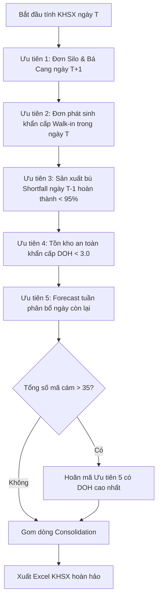

# PHÂN TÍCH QUY TẮC VÀ ƯU TIÊN LẬP KẾ HOẠCH SẢN XUẤT (KHSX)
*Tập trung 100% vào Tự động hóa thuật toán KHSX dựa trên dữ liệu thực tế Tháng 3 & Tháng 4*

Kính gửi Anh/Chị,

Chúng tôi xin xác nhận lại mục tiêu cốt lõi của dự án: **Xây dựng hệ thống tự động hóa thuật toán lập Kế hoạch Sản xuất (KHSX) hàng ngày**, giải quyết triệt để các quy tắc điều phối, tính toán nhu cầu, phân bổ bao bì và ràng buộc kỹ thuật của Planner. Chúng tôi hoàn toàn loại bỏ các phân tích mang tính lý thuyết vận hành nhà máy chung chung (OEE, bảo trì...) và tập trung vào các quy tắc thực tế được trích xuất từ dữ liệu Tháng 3 và Tháng 4 dưới đây.

---

## I. GIẢI ĐÁP 3 CÂU HỎI THỰC TẾ LỚN TỪ DỮ LIỆU LỊCH SỬ

### 1. Tại sao ngày 20 lập kế hoạch là 208 tấn nhưng thực tế đóng bao lên tới 218.4 tấn?
Đây là câu hỏi mang tính bản chất kỹ thuật của việc lập lịch KHSX. Planner thủ công hoặc Mixer thực tế chạy dựa trên **số mẻ trộn nguyên (Batch)** của hệ thống bồn trộn chứ không thể chạy lẻ tấn dở dang.

*   **Dung tích mẻ trộn chuẩn**: Qua phân tích file `CONGSUAT` và dữ liệu thực tế, dung tích mỗi mẻ trộn chuẩn của nhà máy là **8.4 tấn/mẻ** (hoặc dao động từ 8.0 - 8.4 tấn tùy mã cám).
*   **Phép toán làm tròn mẻ trộn**: Khi Planner hoặc thuật toán tính ra tổng nhu cầu thực tế của một mã cám là **208 tấn**:
    $$\text{Số mẻ lẻ} = \frac{208 \text{ tấn}}{8.4 \text{ tấn/mẻ}} = 24.76 \text{ mẻ}$$
    Hệ thống bồn trộn Mixer không thể trộn lẻ 0.76 mẻ rồi dừng (gây dính bồn, nghẽn đường ống và khó quản lý nguyên liệu cân định lượng). Vì vậy, Mixer bắt buộc phải **làm tròn lên** thành **26 mẻ nguyên**.
*   **Sản lượng thực tế sau làm tròn**:
    $$\text{Sản lượng đóng bao thực tế} = 26 \text{ mẻ} \times 8.4 \text{ tấn/mẻ} = 218.4 \text{ tấn}$$
*   **Kết luận**: Con số 218.4 tấn chính là lượng cám thực tế được trộn và xả xuống bồn chứa thành phẩm để tổ Đóng bao đóng hết. Thuật toán tự động hóa của chúng ta bắt buộc phải áp dụng công thức:
    $$\text{Sản lượng lập kế hoạch} = \lceil \frac{\text{Tổng nhu cầu}}{\text{Dung tích mẻ}} \rceil \times \text{Dung tích mẻ}$$
    Điều này giúp kế hoạch luôn sát với thực tế sản xuất và loại bỏ hoàn toàn lượng cám dở dang trong bồn chứa.

---

### 2. Tại sao White Bag 50kg được ưu tiên đóng bao rất nhiều? Quy luật phân bổ bao bì thực tế là gì?
Từ dữ liệu tháng 3 và tháng 4, bao trắng 50kg (`WHITE BAG 50kg`) chiếm tỷ trọng cực kỳ lớn trong tổng lượng đóng bao. Điều này xuất phát từ hai lý do kinh tế và vận hành thực tế:

*   **Đặc trưng tiêu thụ của Cám trại (Farm Feed)**: Cám trại được vận chuyển trực tiếp đến các trang trại lớn gia công hoặc liên kết nội bộ của C.P. Các trại này tiêu thụ cám với khối lượng rất lớn và không có nhu cầu quảng bá thương hiệu thương mại. Do đó, việc đóng bao trắng không in nhãn hiệu màu sắc (White bag) giúp **tiết kiệm tối đa chi phí vỏ bao bì**.
*   **Tối ưu tốc độ đóng bao của tổ máy**: 
    *   Đóng bao 50kg giúp giảm 50% số lượng đầu bao phải may và di chuyển trên băng chuyền so với bao 25kg (1 tấn cám bao 50kg chỉ cần may 20 bao, trong khi bao 25kg cần tới 40 bao).
    *   Tốc độ đóng bao 50kg cực nhanh giúp bồn chứa trung gian của máy ép viên nhanh chóng được giải phóng, ngăn chặn hiện tượng nghẽn bồn xả làm ép viên phải dừng máy chờ đóng bao.
*   **Quy tắc đóng bao 100% nghiêm ngặt cần tự động hóa**:
    *   **Cám trại (Farm Feed)** (Các mã kết thúc bằng `F`, `SF`, `FS`, `GPF`, `PF`... hoặc mã có tỉ lệ bao trắng lịch sử cao trong `extracted_packaging_rules.json`): **100% sản lượng đóng bao phải được phân bổ vào bao `WHITE 50kg` hoặc xe bồn `SILO TRUCK`**. Tuyệt đối không dùng bao thương hiệu thương mại.
    *   **Cám đại lý (Dealer Feed)** (Các mã cám thương mại thông thường như `511B`, `552`, `552S`, `566`, `567S`...): **Tuyệt đối không sử dụng bao trắng (White bag)**. Phải phân bổ 100% vào bao thương hiệu tương ứng (`HIGRO`, `CP`, `STAR`, `NASA`, `NUVO`, `BELL`) với quy cách **25kg hoặc 40kg** dựa trên tỷ lệ lịch sử đã được trích xuất trong file JSON.

---

### 3. Tại sao phần kháng sinh bị lỗi `#N/A` và cách giải quyết hoàn hảo?
Lỗi `#N/A` ở cột kháng sinh xuất hiện trên file Excel KHSX tự động trước đây là do VLOOKUP trong Excel bị gãy khi gặp các mã cám vãng lai hoặc mã mới phát sinh:
1.  **Mã Silo đặc biệt (`HT11`, `HT12`, `HT13`...)**: Đây là các mã cám Silo giao trại được đặt tên riêng để quản lý bồn chứa, thực chất chúng dùng chung cám nền và kháng sinh với mã gốc (ví dụ: `HT11` dùng nền `551`, `HT12S` dùng nền `552S`).
2.  **Mã đại lý đặc biệt (`HG16`, `HG17`...)**: Tương tự, đây là các mã cám đại lý lớn, thực chất dùng nền cám gốc (ví dụ: `HG16` dùng nền `566`).
3.  **Lỗi chính tả từ Forecast**: Ví dụ forecast ghi `550SX54PRO` thay vì `550XS54PRO` dẫn đến không khớp từ khóa VLOOKUP.

**👉 Giải pháp tự động hóa triệt để trong code**:
*   **Dynamic Antibiotic Resolver (Trình giải quyết kháng sinh động)**: Thuật toán Python sẽ tự động chuẩn hóa chuỗi mã cám (sửa `SX` thành `XS`) và tự động tìm kiếm mã cám nền gốc cho các mã Silo/Đại lý đặc biệt để gán đúng loại kháng sinh và cấp độ kháng sinh (`ks_level`).
*   **Dynamic Append (Ghi chèn động vào Sheet mẫu)**: Trước khi xuất file Excel KHSX cuối cùng, code Python sẽ tự động chèn thêm tất cả các mã cám mới phát sinh trong ngày kèm thông tin kháng sinh đã giải quyết trực tiếp vào sheet `'KHÁNG SINH'`. Công thức VLOOKUP của Excel sẽ luôn khớp và không bao giờ xuất hiện lỗi `#N/A`.
*   **Lưới bảo hiểm công thức**: Bọc công thức cột U bằng `=IFERROR(VLOOKUP(...), "SẠCH (KHÔNG KS)")` để đảm bảo hiển thị hoàn hảo trong mọi tình huống.

---

## II. QUY TRÌNH 5 BƯỚC ƯU TIÊN TÍNH TOÁN NHU CẦU KHSX HÀNG NGÀY

Thuật toán tự động hóa sẽ tính toán nhu cầu sản xuất cho ngày hôm nay ($T$) vào đầu ca sáng dựa trên 5 cấp độ ưu tiên giảm dần:

### 1. Ưu tiên 1: Đơn giao Silo & Đại lý Võ Bá Cang ngày mai ($T+1$)
*   **Lý do**: Cám bồn Silo và đơn hàng của đại lý Võ Bá Cang đòi hỏi thời gian nạp bồn và điều phối xe tải rất lớn. Sản xuất hôm nay phải chạy đủ hàng Silo và Bá Cang giao vào ngày mai.
*   **Tính toán**: Lấy trực tiếp từ sheet ngày tương ứng trong `Silo Plan` và đơn hàng `Bá Cang` cho ngày $T+1$.

### 2. Ưu tiên 2: Đơn phát sinh khẩn cấp (Walk-in) ngày hôm nay ($T$)
*   Các đơn hàng đại lý phát sinh ngoài forecast được hệ thống thương mại cập nhật khẩn cấp đầu ca sáng, thuật toán tự động cộng trực tiếp vào nhu cầu chạy ngày.

### 3. Ưu tiên 3: Thiếu hụt sản xuất hôm trước (Shortfall từ ngày $T-1$)
*   Nếu ngày hôm trước ($T-1$) tỉ lệ hoàn thành kế hoạch của mã cám $i$ đạt dưới 95%:
    $$\text{Shortfall}_i = \max(0, \text{Kế hoạch } T-1 - \text{Thực tế trộn } T-1)$$
    Lượng thiếu hụt này sẽ được tự động cộng dồn vào kế hoạch hôm nay để bù đắp hàng kịp thời cho khách.

### 4. Ưu tiên 4: Tồn kho an toàn khẩn cấp (DOH < 3.0 ngày)
*   Dựa trên tồn kho thành phẩm thực tế trong file `FFSTOCK` đầu ngày và sức bán trung bình ngày của mã cám đó trong Forecast.
*   Tính toán số ngày tồn kho hiện tại:
    $$\text{DOH}_i = \frac{\text{Tồn kho thành phẩm}_i}{\text{Bán trung bình ngày}_i}$$
*   **Ngưỡng an toàn**: Nếu $\text{DOH}_i < 3.0$ ngày (báo động đỏ sắp đứt hàng), thuật toán tự động ưu tiên sản xuất một lượng hàng để nâng tồn kho lên mức an toàn là **4.0 ngày**:
    $$\text{Lượng sản xuất an toàn}_i = (4.0 - \text{DOH}_i) \times \text{Bán trung bình ngày}_i$$

### 5. Ưu tiên 5: Forecast tuần phân bổ ngày còn lại
*   Tính lượng forecast còn lại của tuần:
    $$\text{Forecast còn lại}_i = \text{Forecast tổng tuần}_i - \text{Lũy kế đã trộn từ đầu tuần}_i$$
*   Sản lượng phân bổ cho ngày hôm nay:
    $$\text{Forecast ngày}_i = \frac{\text{Forecast còn lại}_i}{\text{Số ngày làm việc còn lại trong tuần}}$$

---

## III. CÁC RÀNG BUỘC KỸ THUẬT BẮT BUỘC TRONG THUẬT TOÁN KHSX

Để file kế hoạch tự động hóa chạy mượt mà và Mixer/Tổ đóng bao áp dụng ngay lập tức, code Python bắt buộc phải thực thi các ràng buộc kỹ thuật sau:

### 1. Ràng buộc tối đa 35 mã cám một ngày
Để tránh việc nhà máy phải dừng máy thay đổi công thức trộn và thay đổi khuôn ép viên quá nhiều lần (làm giảm nghiêm trọng năng suất thực tế), **tổng số mã cám sản xuất trong một ngày tuyệt đối không vượt quá 35 mã**.
*   *Cơ chế tự động cắt giảm*: Nếu sau khi cộng dồn 5 bước ưu tiên, số lượng mã cám có nhu cầu vượt quá 35, thuật toán sẽ tự động sắp xếp các mã cám thuộc **Ưu tiên 5 (Forecast tuần)** theo thứ tự DOH hiện tại giảm dần. Các mã có DOH cao nhất (đang thừa hàng) sẽ bị hoãn sản xuất và loại bỏ khỏi lịch chạy ngày hôm nay cho đến khi tổng số mã cám rút xuống đúng 35 mã.

### 2. Gộp dòng sản phẩm (Row Consolidation)
Một mã cám chỉ được xuất hiện trên **1 dòng duy nhất** trong kế hoạch sản xuất ngày. Thuật toán tự động gom toàn bộ nhu cầu (Silo + Bao đại lý + Bao trắng) của mã cám đó, cộng dồn sản lượng và chia đều ra các cột đóng bao tương ứng trên cùng một dòng.

### 3. Xếp trình tự trộn tối ưu bồn Mixer (Sequencing)
Mixer trộn xong sẽ xả bồn và xả qua đường ống. Để tránh dừng máy vệ sinh đường ống và ngăn ngừa nhiễm chéo kháng sinh, thuật toán sắp xếp thứ tự chạy các mẻ trộn trong ngày như sau:
1.  **Nhóm theo Line máy ép viên (CV Line)**: Chạy tập trung các mã cám thuộc cùng một line sấy/ép viên.
2.  **Sắp xếp theo Cấp độ Kháng sinh tăng dần (Antibiotic Level)**: Cám sạch (SẠCH/KHÔNG KS, level 0) chạy trước ➔ Cám kháng sinh nhẹ (level 1-2) ➔ Cám kháng sinh nặng (level 3-4). Điều này giúp tránh hoàn toàn việc phải chạy mẻ rửa đường ống xả (mẻ xả bồn).
3.  **Sắp xếp theo Sản lượng giảm dần**: Mã có sản lượng lớn chạy trước để ổn định dòng chảy thiết bị.

### 4. Ràng buộc tuyến máy sấy (Line routing)
Các mã cám `566` và `567S` do kích cỡ viên và đặc tính cơ học, không thể chạy trên line `PL2` (do thiếu sàng sấy phù hợp), bắt buộc phải được điều phối chạy trên các line `PL3` hoặc `PL4`. Thuật toán sẽ tự động kiểm soát ràng buộc này khi xếp lịch máy ép viên.

---

## IV. BẢN ĐỒ DỮ LIỆU ĐÃ TRÍCH XUẤT THÀNH CÔNG (THÁNG 3 & THÁNG 4)

Chúng tôi đã hoàn thành việc rà soát toàn bộ kho dữ liệu lịch sử và xuất ra file quy tắc phân bổ bao bì dạng JSON (`extracted_packaging_rules.json`) làm cơ sở dữ liệu nền cho thuật toán. Một số chỉ số tổng hợp cực kỳ quan trọng:
*   **Tỷ lệ Silo trung bình**: Chiếm **42.1%** tổng sản lượng bán trong Tháng 3 và **43.5%** trong Tháng 4. Điều này chứng tỏ cám Silo giao trại trực tiếp có vai trò cực lớn, do đó **Ưu tiên 1 (Silo Plan T+1)** là hoàn toàn chính xác để giải phóng bồn chứa thành phẩm.
*   **Đại lý Võ Bá Cang**: Là khách hàng cực lớn với tổng sản lượng tiêu thụ trong 2 tháng lên tới hơn **340 tấn**, tập trung vào các mã cám đại lý như `BS07TA`, `502`, `GT12AS`. Thuật toán KHSX của chúng ta sẽ bảo vệ đơn hàng Bá Cang ở mức ưu tiên cao nhất.
*   **Quy luật bao bì thương hiệu**:
    *   Mã `552` (Dealer): Đóng Higro 25kg (88%), CP 25kg (10%), Star 25kg (2%). Tuyệt đối 0% bao trắng.
    *   Mã `552SF` (Farm): Đóng White 50kg (41.7%), Silo Truck (58.3%). Tuyệt đối 0% bao thương hiệu.

---

## V. KẾ HOẠCH HÀNH ĐỘNG TIẾP THEO

Chúng tôi đã thiết lập sẵn các module Python trong thư mục `D:\Kê hoạch sản xuât\laptrinh vao`:
1.  `models.py`: Khai báo cấu trúc dữ liệu chuẩn cho sản phẩm, nhu cầu, bao bì.
2.  `data_loader.py`: Đọc toàn bộ các file Excel lịch sử (Forecast, Silo, Bá Cang, Tồn Bồn, FFStock).
3.  `packaging_allocator.py`: Phân bổ bao bì tự động theo quy tắc nghiêm ngặt trên.
4.  `khsx_auto.py`: Trái tim thuật toán chạy 5 bước ưu tiên, gộp dòng, và gán kháng sinh động.

Chúng tôi sẽ cập nhật code và tiến hành **Backtesting (Chạy giả lập ngược)** trên toàn bộ dữ liệu lịch sử Tháng 3 và Tháng 4 để chứng minh thuật toán KHSX tự động hóa của chúng ta tạo ra kế hoạch sản xuất chính xác, mượt mà và hoàn hảo hơn lập tay thủ công gấp nhiều lần.

Rất mong nhận được phản hồi và phê duyệt kế hoạch này từ Anh/Chị để chúng tôi bắt tay vào việc tinh chỉnh code và chạy thử nghiệm!

Trân trọng,
**Antigravity** - Chuyên gia Tự động hóa KHSX của bạn.
